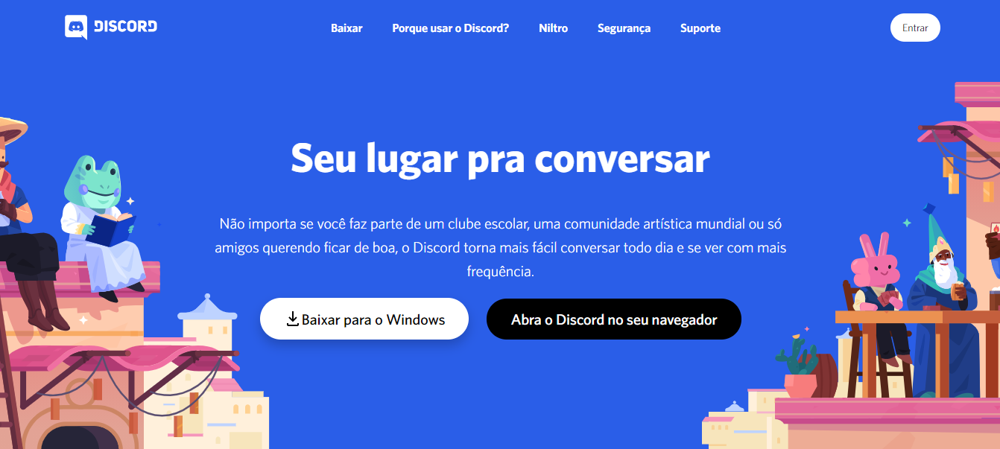

<h1 align="center">Clone Discord</h1>

<p align="center">Clone de todos os elementos que compõe a página inicial do <a href="https://discord.com/">Discord</a> </p>

### Atenção

Ainda não possui responsividade

### Features

- [x] Clone página Home

<p align="center"></p>

### Pré-requisitos

Antes de começar, você vai precisar ter instalado em sua máquina as seguintes ferramentas:
[Git](https://git-scm.com), [Node.js](https://nodejs.org/en/), [React](https://pt-br.reactjs.org/). Além disto é bom ter um editor para trabalhar com o código como [VSCode](https://code.visualstudio.com/)

### 🎲 Rodando aplicação Web

```bash
# Clone este repositório
$ git clone <https://github.com/daviddossantos/clone-discord>

# Acesse a pasta do projeto no terminal/cmd
$ cd clone-discord

# Instale as dependências
$ yarn install

# Execute a aplicação
$ yarn start
```

### ⚔ Tecnologias

As seguintes ferramentas foram usadas na construção do projeto:

- [React JS](https://github.com/daviddossantos/clone-discord)
- [Node.js](https://nodejs.org/en/)
- [JavaScript](https://www.javascript.com/)
- [Styled Components](https://styled-components.com/)
- [FlexBox](https://origamid.com/projetos/flexbox-guia-completo/)
- [CssGrid](https://www.origamid.com/projetos/css-grid-layout-guia-completo/)

Feito com 💖 by David Cruz 😀 [Entre em contato!](https://www.linkedin.com/in/daviddossantoscruz/)

## 🗂 Licença

Esse projeto está sob a licença MIT. Veja o arquivo [LICENSE](LICENSE.md) para mais detalhes.

---
